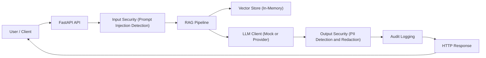
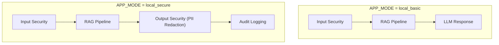
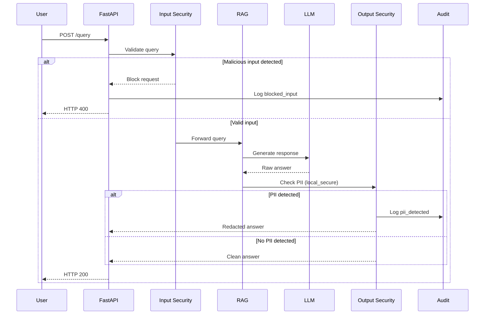

# Secure RAG from Scratch – Technical Documentation

## Introduction

This project is a **personal learning journey** focused on understanding how to design, secure, and validate
LLM-based systems, starting from first principles.

Instead of relying on abstract diagrams or managed services, the goal is to:
- Build a Retrieval-Augmented Generation (RAG) system from scratch
- Apply concrete security controls
- Validate behavior through real tests
- Document both successes and failures

This repository reflects **what I actually tested and learned**, not just what worked on the first try.

## Project Goals

The main goals of this project are:

- Understand how RAG pipelines work end to end
- Identify real security risks in LLM-based systems
- Apply input, output, and audit controls
- Learn by breaking, fixing, and validating the system
- Create a solid baseline before moving to cloud or MLOps environments

## Architecture – Version 1 (Local Secure RAG)

This repository currently implements **Architecture v1**, designed as a local, security-first baseline.

Key characteristics:
- Local execution
- No external dependencies required to test security
- Explicit control points for input validation, output filtering, and auditing
- Configuration-based security modes (`local_basic`, `local_secure`)

This version serves as a **reference baseline** that will evolve in future iterations.

Client → FastAPI → Input Security → RAG Pipeline → Output Security → Audit → Response

---

## Execution Modes (APP_MODE)

The system supports progressive security hardening using execution modes.

## Security Approach

Security controls are intentionally implemented **outside of the LLM**.

This project focuses on three main control layers:

- **Input Security**
  - Prompt injection detection
  - Fail-fast blocking before the RAG pipeline

- **Output Security**
  - Detection of personally identifiable information (PII)
  - Redaction of sensitive data before returning responses

- **Audit Logging**
  - Structured JSON logs
  - Explicit security events (`blocked_input`, `pii_detected`)
  - Designed for traceability and future compliance

---

## Security Flow (Detailed)

---
## Validation & Testing

All validation in this phase was performed manually to ensure full control and understanding
of system behavior.

The goal was **not model quality**, but **security correctness**.

### Evidence (Screenshots)

The following screenshots document the validation performed during this phase:

- API startup
- Swagger availability
- Baseline RAG response
- Prompt injection blocking
- Secure mode startup
- PII redaction
- Audit logs

Screenshots are available under:

docs/screenshots/

## Lessons Learned

Some key lessons from this first version:

- Security controls must be validated, not assumed
- Mocking the LLM is essential to test security independently of providers
- Running in different modes surfaced configuration-related issues early

These lessons directly influence the design of future versions.

## Out of Scope (For Now)

The following topics are intentionally not covered in this version:

- Model accuracy evaluation
- Performance and load testing
- Cloud-native authentication and IAM
- Multi-tenant isolation
- Production-grade persistence

These areas will be addressed in future iterations.

## Next Steps

Planned next steps include:

- Threat modeling based on this architecture
- Mapping controls to OWASP LLM Top 10
- Evolving the architecture to a cloud-ready version
- Introducing automated security tests
