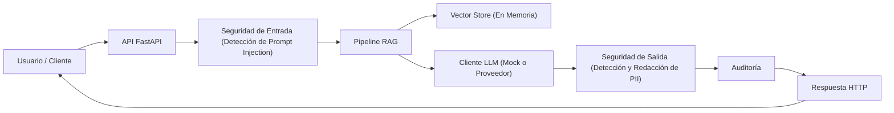
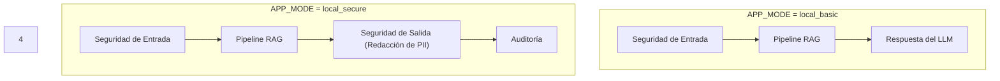
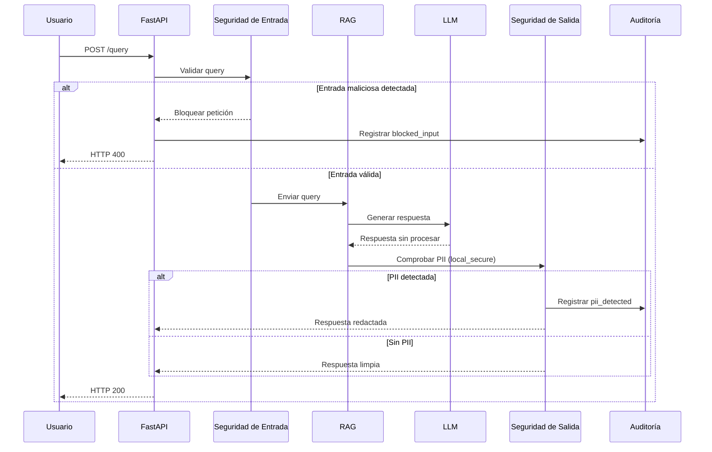

# Secure RAG from Scratch – Documentación Técnica

## Introducción

Este proyecto es un recorrido personal de aprendizaje centrado en comprender cómo diseñar, asegurar y validar
sistemas basados en LLM, partiendo de primeros principios.

En lugar de apoyarse en diagramas abstractos o servicios gestionados, el objetivo es:
- Construir un sistema de Retrieval-Augmented Generation (RAG) desde cero
- Aplicar controles de seguridad concretos
- Validar el comportamiento mediante pruebas reales
- Documentar tanto los aciertos como los errores
- Este repositorio refleja lo que realmente he probado y aprendido, no solo lo que funcionó a la primera.

## Objetivos del proyecto

Los principales objetivos de este proyecto son:
- Entender cómo funcionan los pipelines RAG de extremo a extremo
- Identificar riesgos de seguridad reales en sistemas basados en LLM
- Aplicar controles de seguridad de entrada, salida y auditoría
- Aprender rompiendo, corrigiendo y validando el sistema
- Crear una base sólida antes de evolucionar hacia entornos cloud o MLOps

## Arquitectura – Versión 1 (RAG Seguro Local)

Este repositorio implementa actualmente la Arquitectura v1, diseñada como una base local y orientada a la seguridad.

Características principales:
- Ejecución local
- Sin dependencias externas necesarias para probar la seguridad
- Puntos de control explícitos para validación de entrada, filtrado de salida y auditoría
- Modos de ejecución configurables (local_basic, local_secure)

Esta versión sirve como una línea base de referencia que evolucionará en iteraciones futuras.

Flujo general:

Cliente → FastAPI → Seguridad de Entrada → Pipeline RAG → Seguridad de Salida → Auditoría → Respuesta

---

## Modos de Ejecución (APP_MODE)

El sistema permite un endurecimiento progresivo de la seguridad mediante distintos modos de ejecución.

## Enfoque de Seguridad

Los controles de seguridad se implementan intencionadamente fuera del LLM.

Este proyecto se centra en tres capas principales de control:

- **Seguridad de Entrada**
- Detección de prompt injection
- Bloqueo inmediato antes de ejecutar el pipeline RAG

- **Seguridad de Salida**
- Detección de información personal identificable (PII)
- Redacción de datos sensibles antes de devolver la respuesta

- **Auditoría**
- Logs estructurados en formato JSON
- Eventos de seguridad explícitos (blocked_input, pii_detected)
- Diseñado para trazabilidad y futuros escenarios de cumplimiento

---

## Flujo de Seguridad (Detalle)

---
## Validación y Pruebas

Toda la validación en esta fase se realizó de forma manual, para garantizar un control total y una comprensión completa
del comportamiento del sistema.

El objetivo no fue la **calidad del modelo**, sino la **correcta implementación de los controles de seguridad**.

### Evidencias (Capturas de Pantalla)

Las siguientes capturas documentan las validaciones realizadas:

- Arranque de la API
- Disponibilidad de Swagger
- Respuesta base del RAG
- Bloqueo de prompt injection
- Arranque en modo seguro
- Redacción de PII
- Logs de auditoría

Las capturas están disponibles en:

docs/screenshots/

## Lecciones Aprendidas

Algunas de las principales lecciones de esta primera versión:

- Los controles de seguridad deben validarse, no asumirse
- El uso de un LLM simulado es clave para probar la seguridad de forma independiente
- Ejecutar el sistema en distintos modos ha permitido detectar problemas de configuración de forma temprana

Estas lecciones influyen directamente en el diseño de las siguientes versiones.

## Fuera de Alcance (Por Ahora)

Los siguientes aspectos no se cubren intencionadamente en esta versión:

- Evaluación de la precisión del modelo
- Pruebas de rendimiento y carga
- Autenticación cloud y gestión de identidades (IAM)
- Aislamiento multi-tenant
- Persistencia de nivel productivo

Estos aspectos se abordarán en iteraciones futuras.

## Próximos Pasos

Los próximos pasos previstos incluyen:

- Threat modeling basado en esta arquitectura
- Mapeo de controles frente al OWASP LLM Top 10
- Evolución hacia una arquitectura preparada para cloud
- Introducción de pruebas de seguridad automatizadas
